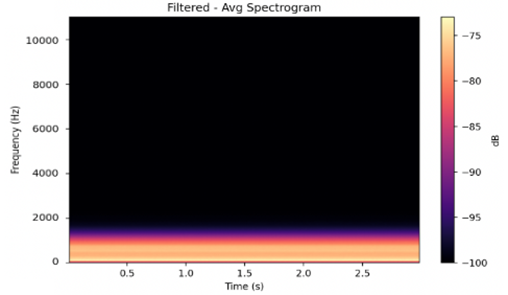
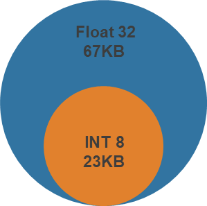

# **Miniaturizing AI Models for Edge Deployment in Marine Vessel Classification**

In collaboration with FedWriters Inc., I led a capstone project focused on designing lightweight AI models capable of performing real-time marine vessel classification on resource-constrained edge devices. Using QiandaoEAR22 acoustic dataset (19,694 WAV files), we extracted robust audio features like MFCC and Mel-spectrograms(Fig1), then applied model quanitzation from float32 to 8-int bit(Fig2) and pruning techniques to optimize for low-power deployment.

{width="508"}

~Fig\ 1:\ Filtered\ Average\ Spectrogram~

Despite reaching model size, we maintained 98% classification accuracy, enabling accurate vessel detection even in noisy, low-bandwidth environments. This project addressed real-world challenged like Doppler effect distortion and limited connectivity, contributing to the growing field of edge AI in environmental monitoring and defense applications.

{width="159"}

~Fig\ 2\ model\ size\ comparison~
