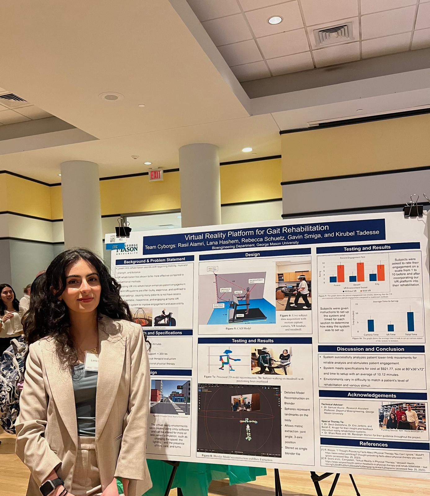

---
title: "Website"
author: "Lana Hashem"
format: html
editor: visual
execute: 
  echo: false
---

{fig-align="left" width="185"}

**Bio**

My name is Lana Hashem, and I am a recent bioengineering graduate currently completing an accelerated master's degree in data analytics engineering at George Mason University. I have experience in Python, R, SQL, and C programming languages.
