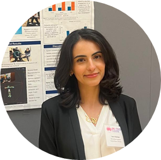

**About me**

I'm Lana Hashem, a data analytics engineer and a bioengineer based in Northern Virginia, with a strong focus in machine learning, data visualization, and real-world problem solving. I hold a Master's in Data Analytics Engineering and a Bachelor's in Bioengineering, both from George Mason University where I graduated with Honors and made the Dean's List numerous times.

I specialize in transforming raw data into actionable insights. My academic and project experience range is wide, from healthcare and air quality analysis to edge AI deployment and virtual reality. Most recently, I partnered with FedWriters Inc. on a capstone project to miniaturize AI models for real-time vessel classification on edge devices under water, achieving 98% accuracy after quantization.

With a background in programming (Python, R, SQL, C/C#), cloud platforms (AWS), data pipelines and tools like TensorFlow Lite and Fusion360, I bring technical depth to the table. I'm also fluent in English and Arabic, with beginner proficiency in French.

I'm passionate about using technology to solve meaningful challenges whether it's building end-to-end analytics pipelines, deploying AI models in constrained environments, or designing intuitive data-driven systems.
